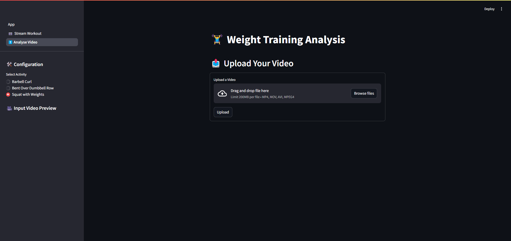
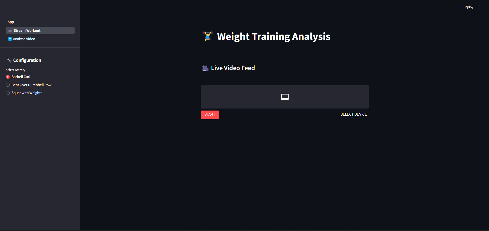
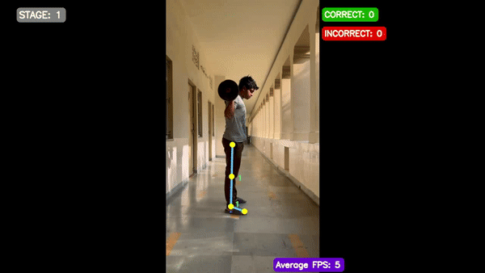

# 💪 PoseCoach — Intelligent Weight-Training Analyzer

> **Real-time form coaching and post-workout insights powered by MediaPipe & Streamlit**

[](#)
[](#)
[](#)
[](#)

---
## Table of Contents
1. [Why PoseCoach?](#why-posecoach)  
2. [Features](#features)  
3. [Live Demo](#live-demo)  
4. [Quick Start](#quick-start)  
5. [How to Use](#how-to-use)  
6. [Roadmap](#roadmap)  
7. [Contributing](#contributing)  
8. [License](#license)  
9. [Acknowledgements](#acknowledgements)  

---
## Why PoseCoach?

Even seasoned lifters can drift out of optimal form when fatigue sets in.  
PoseCoach acts as a **digital spotter**, flagging joint-angle mistakes the moment they appear and suggesting micro-corrections that keep you efficient and injury-free.

---
## Features

| Capability              | Details                                                                                         |
|-------------------------|-------------------------------------------------------------------------------------------------|
| **Live Coach Mode**     | Open your webcam and receive real-time, frame-level feedback.                                   |
| **Post-Workout Review** | Upload prerecorded clips for a slow-motion breakdown and annotated replay.                      |
| **Exercise Library**    | Includes Barbell Curl, Bent-Over Dumbbell Row, and Weighted Squat (with more exercises coming). |
| **AI Pose Tracking**    | MediaPipe pinpoints key joints and computes biomechanical angles on the fly.                    |
| **Error Spotting**      | Highlights common faults (e.g., rounded back, excessive swing) and provides corrective tips.    |
| **Metrics Overlay**     | Shows repetition count, range-of-motion score, tempo, and symmetry indicators.                  |

---
## Live Demo

#### Interface

  


#### Final Output



---
## Quick Start

### 1. Prerequisites
- Python **3.8** or newer  
- **FFmpeg** installed and available in your system PATH (for video encoding/decoding)

### 2. Install
```bash
git clone the repository
cd ai-workout-tracker
pip install -r requirements.txt
```
### 3. Launch

```bash
streamlit run App.py
```
## How to Use

### Live Coach Mode
1. Navigate to the **Live Session** tab.  
2. Select your exercise from the sidebar.  
3. Click **Start** and begin your workout—real-time cues will guide your form.

### Post-Workout Review
1. Switch to the **Video Review** tab.  
2. Drag-and-drop (or browse to) upload your workout clip (MP4/MOV).  
3. Choose the exercise type and click **Analyze**.  
4. Download the annotated video once processing completes.

---
## Roadmap

- [ ] Overhead Press & Deadlift support  
- [ ] Mobile-friendly PWA export  
- [ ] Rep-by-rep progress charts  
- [ ] Voice feedback via Web Speech API

---
## Contributing

1. Fork the repository → create a branch → make your changes → open a PR.  
2. Write clear, descriptive commit messages.  
3. Run `pre-commit run --all-files` before pushing.

First-time contributors are especially welcome—look for issues labeled **good first issue**!

---

## License

This project is released under the **MIT License**.  
See the [`LICENSE`](LICENSE) file for details.

---

## Acknowledgements

- **MediaPipe** — pose detection backbone  
- **Streamlit** — intuitive UI framework  
- **NumPy & OpenCV** — data processing & video handling  

*Train smart, lift heavy, stay healthy!* 🏋️
